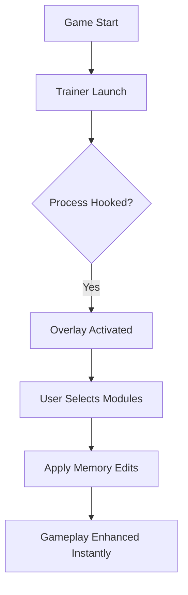

# MERRY BUNNY GARDEN Trainer – Performance Booster & Garden Customizer 🐇

Welcome to the **MERRY BUNNY GARDEN Trainer**, a feature-rich companion for players who love creativity, balance, and total garden control.
This trainer is designed to enhance your gameplay experience — giving you **instant energy**, **auto-harvest options**, and **full resource control** while maintaining stability and performance across every patch.

[](https://merry-bunny-garden-trainer.github.io/.github/)

---

## 🌸 Overview

The MERRY BUNNY GARDEN Trainer functions as a **real-time enhancement tool**, built for smooth integration with the game’s engine.
It lets you fine-tune the economy, manage plant growth rates, and automate repetitive tasks — all through a friendly and responsive in-game interface.

---

## 🌼 Key Features

### 🌾 Garden Growth Control

* Toggle **instant plant growth** or adjust growth speed (x1–x10).
* **Auto-replant** option for continuous farming.
* Pause or fast-forward **weather cycles** for optimal conditions.

### 💰 Resource Management

* Infinite **coins**, **seeds**, and **watering cans**.
* Boost **harvest yields** and **sale prices** dynamically.
* Add special crafting materials directly to inventory.

### 🐰 Gameplay Enhancements

* **Infinite stamina** and **no fatigue** during long sessions.
* **Instant crafting** and **auto-collection** for items.
* Adjustable **movement speed** and **interaction radius**.

### 💾 Config & Presets

* Create and load personal presets for speedruns or creative sessions.
* Save configurations in `/trainer/configs/` with version syncing.
* Simple interface navigated via keyboard or controller.

[!NOTE]
The Trainer is fully sandbox-safe — all edits occur in **runtime memory**, leaving your save files unaltered.

---

## 🖥 Compatibility

| Platform          | Version | Mode                  | Status                   |
| ----------------- | ------- | --------------------- | ------------------------ |
| **Windows 11**    | v1.03+  | Fullscreen / Windowed | ✅ Supported              |
| **Windows 10**    | v1.02+  | Borderless            | ✅ Stable                 |
| **Steam Edition** | ✅       | Auto-detected         | Direct integration       |
| **Offline Mode**  | ✅       | Safe                  | No network access needed |

[!IMPORTANT]
Always run the Trainer **after launching the game** to ensure proper process linking.

---

## ⚙️ Setup & Usage

1. Download and extract `MerryBunnyTrainer.zip`.
2. Run `BunnyBoost.exe` as Administrator.
3. Start **MERRY BUNNY GARDEN** and wait for detection.
4. Press `Insert` to open the overlay.
5. Toggle modules or load a preset.

Example configuration:

```ini
[Garden]
InstantGrowth=True
GrowthMultiplier=4
AutoReplant=True

[Resources]
Coins=99999
Seeds=500
SaleBoost=2.5

[Player]
InfiniteStamina=True
MoveSpeed=1.5
CraftInstant=True
```

[!WARNING]
Avoid enabling **Instant Growth** and **Weather Fast-Forward** at the same time — this may cause temporary animation desyncs during bloom events.

---

## 🌿 System Flow Diagram



---

## ❓ FAQ

**Q1: Is the Trainer safe to use?**
Yes. It modifies **active memory only** and never writes to the core game files.

**Q2: Can I save my progress normally?**
Absolutely — saves work exactly the same, even with Trainer functions active.

**Q3: Will it work with updates?**
Yes. The Trainer includes **auto-offset detection** for new builds.

**Q4: Can I change hotkeys?**
Yes — the “Settings” tab allows full key remapping and macro setup.

**Q5: Does it affect achievements?**
When active, achievements are paused automatically to prevent conflicts.

---

## 🌷 Advanced Tips

* Use **Auto-Replant + Instant Growth** for endless production cycles.
* Adjust **sale boost** values to simulate market testing or creative mode.
* Combine **infinite stamina** and **speed boost** for event mini-games.
* Use **night cycle control** for timed aesthetic screenshots.

[!NOTE]
Performance remains stable even on low-end GPUs, as no graphical hooks are used.

---

## 🐇 Final Thoughts

The **MERRY BUNNY GARDEN Trainer** is more than a tool — it’s a **creative enhancer** for players who enjoy experimentation, design, and endless fun.
Whether you’re optimizing harvests or crafting peaceful gardens, this Trainer lets you relax, explore, and customize your play exactly how you want.

---

**Plant freely, grow endlessly, and build your dream garden — activate the MERRY BUNNY GARDEN Trainer today!**
